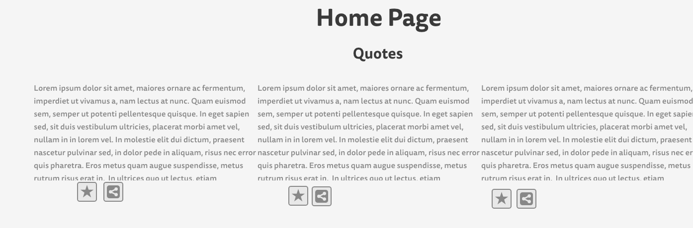
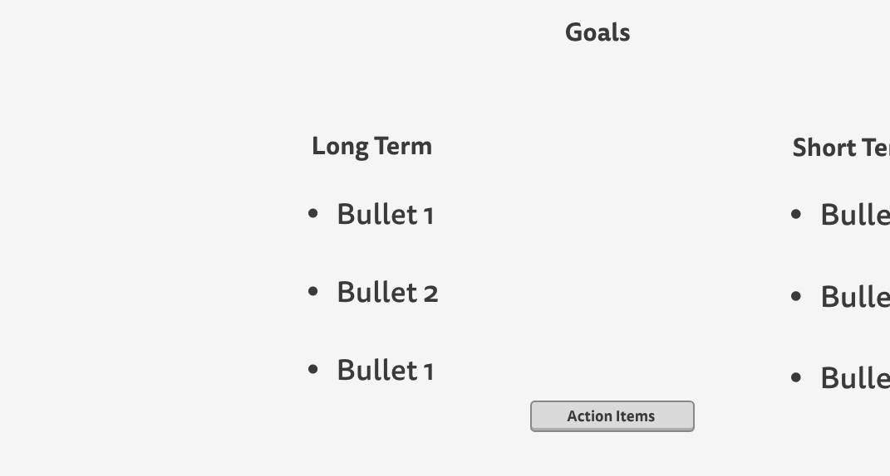
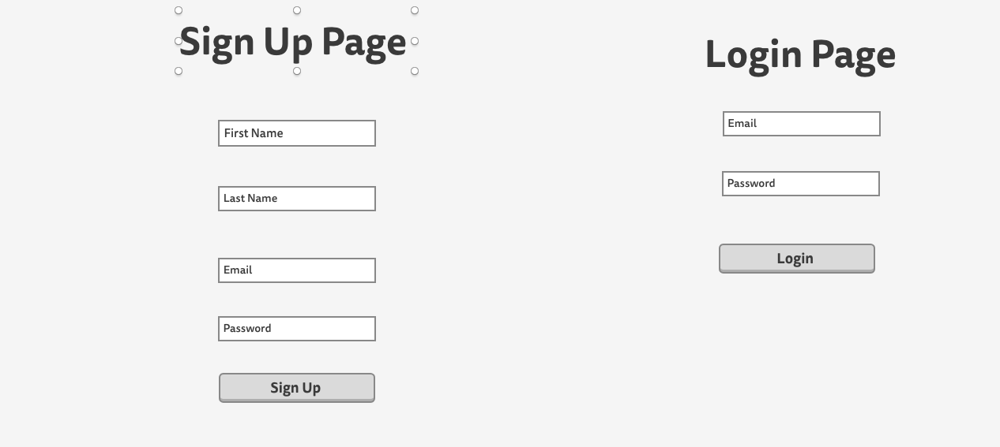
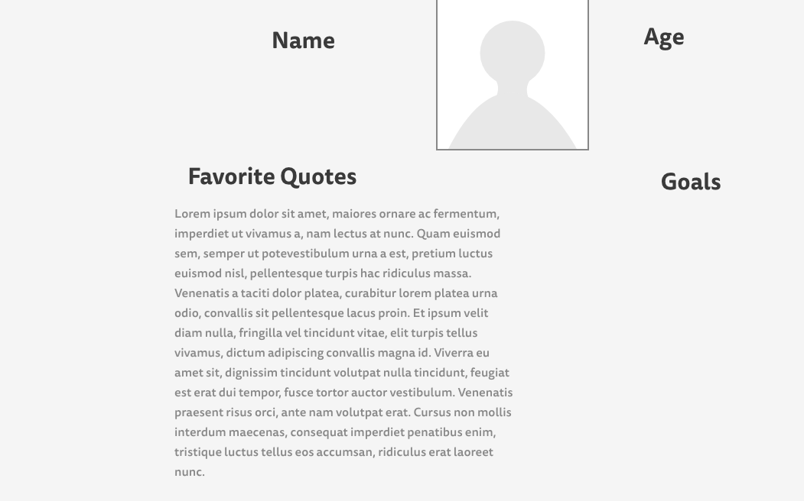
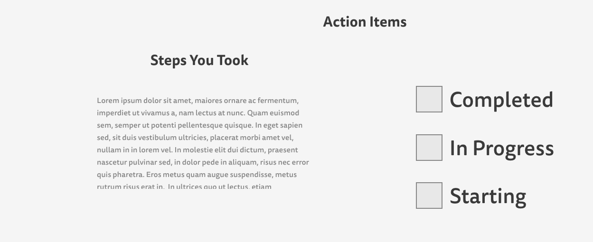
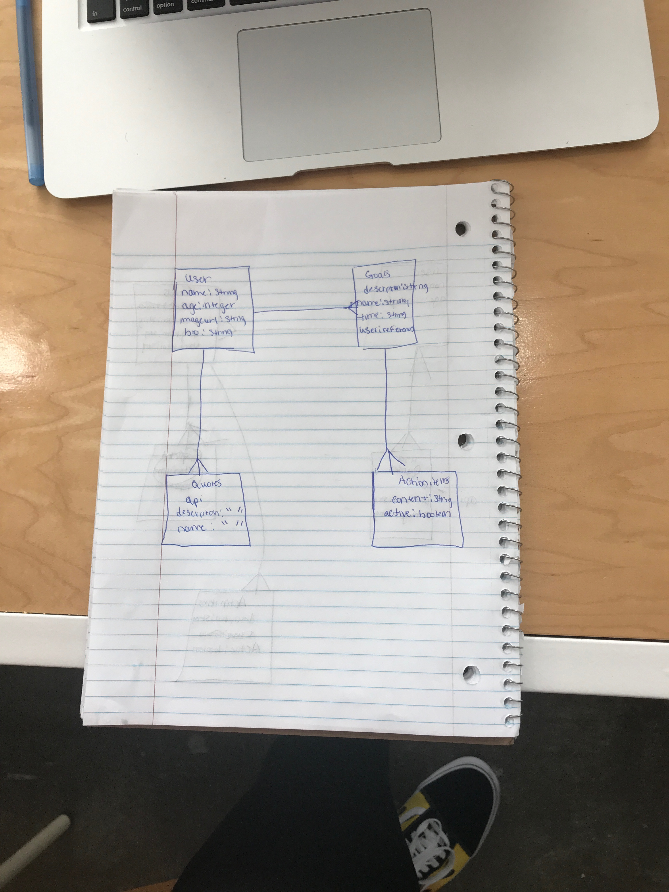

# README

# Be Happy 

# Heroku 

# Wireframes
]
]
]
]
]

# Erd 

I created a app where you can go to different User Pages and see their goals. You can go through their goals and see what action items they are going to take to accomplish those goals. 

